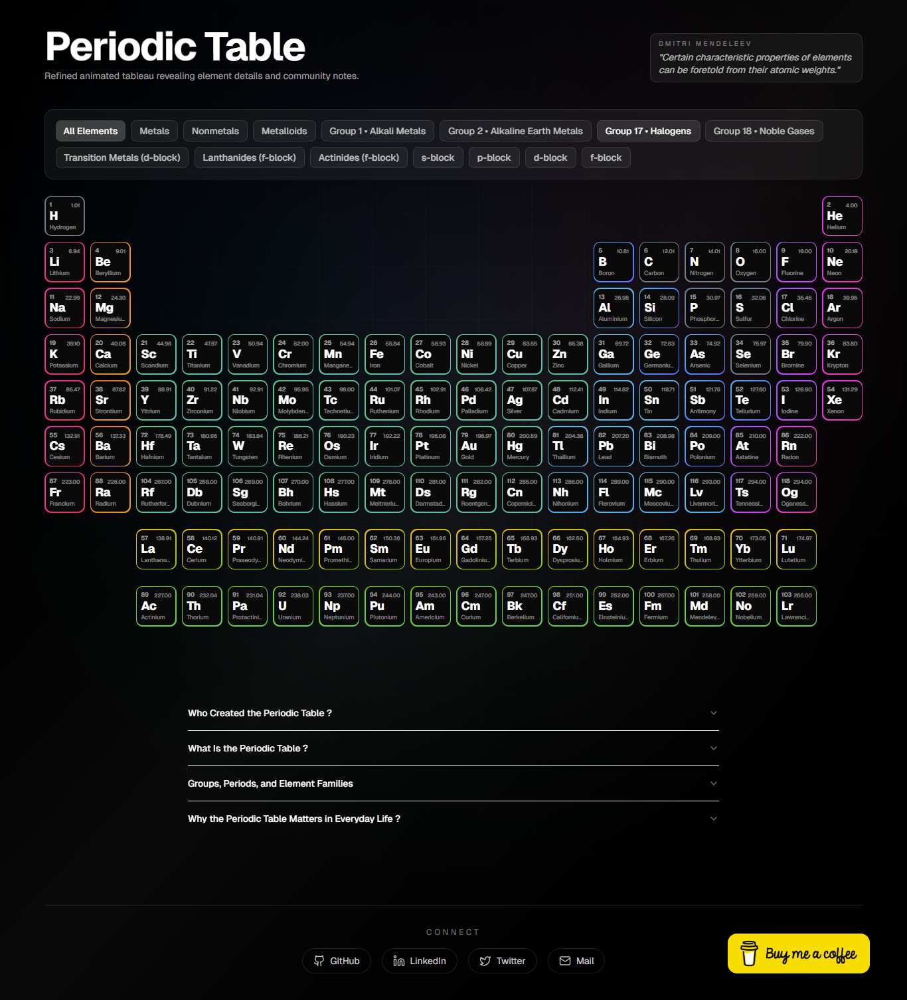
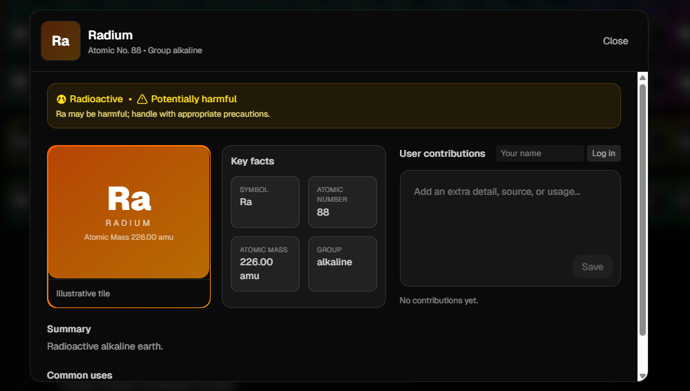
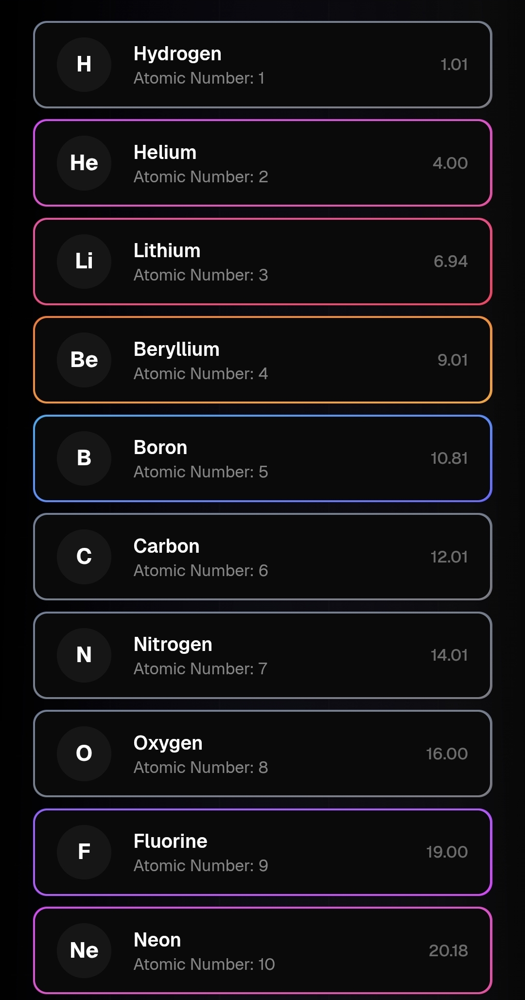

# 🧪 Periodic Table UI

An **interactive digital periodic table** built using **HTML, CSS, and JavaScript**.
This project provides a clean and user-friendly interface to explore chemical elements with visual grouping and basic element information.

---

## 📌 Project Overview

The **Periodic Table UI** is a front-end web project designed to help students and learners easily understand the periodic table through an interactive layout.
Users can visually identify element groups and interact with elements to view their details.

---

## ✨ Features

* 📊 Complete periodic table layout
* 🖱️ Interactive elements (hover or click to view details)
* 🎨 Color-coded element categories

  * Metals
  * Non-metals
  * Metalloids
* 📱 Responsive design for desktop and mobile
* ⚡ Fast and lightweight (no backend required)
* 🧠 Educational and beginner-friendly

---

## 🖼️ Screenshots

### 🔹 Desktop View



### 🔹 Element Details / Interaction




### 🔹 Mobile View




📁 **Tip:** Create a `screenshots/` folder in your repository and place the images there.

---

## 🛠️ Technologies Used

* **HTML5** – Structure
* **CSS3** – Styling and layout
* **JavaScript (ES6)** – Interactivity and logic

---

## 📂 Project Structure

```bash
Periodic-Table-UI/
│
├── public/            # Static assets
├── src/               # Main source files
│   ├── css/           # Stylesheets
│   ├── js/            # JavaScript logic
│   └── data/          # Element data (if applicable)
│
├── index.html         # Main HTML file
├── package.json       # Project configuration
└── README.md          # Project documentation
```

---

## 🚀 Getting Started

### 1️⃣ Clone the repository

```bash
git clone https://github.com/nimeduhansaka/Periodic-Table-UI.git
```

### 2️⃣ Navigate to the project folder

```bash
cd Periodic-Table-UI
```

### 3️⃣ Run the project

* Open `index.html` directly in your browser
  **OR**
* Use a local server (recommended):

```bash
npm install
npm run dev
```

---

## 📖 How to Use

* Hover over or click an element to see its details
* Observe color coding to identify element categories
* Resize the browser to see responsive behavior

---

## 🎯 Use Cases

* School and college chemistry learning
* Educational demonstrations
* Front-end UI practice project
* Portfolio project for web development

---

## 🔮 Future Improvements

* 🔍 Search functionality
* 🧪 More detailed element properties
* 🌗 Dark mode
* 🎞️ Smooth animations and transitions
* 📱 Enhanced mobile UI

---

## 📜 License

This project is licensed under the **MIT License**.
You are free to use, modify, and distribute this project.

---

## 👤 Author

**Nimedu Hansaka**
GitHub: [https://github.com/nimeduhansaka](https://github.com/nimeduhansaka)
